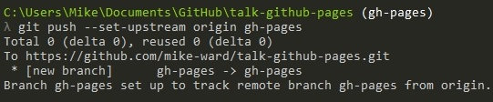

title: GitHub Pages  
author:  
  name: Mike Ward  
  twitter: mikeward_aa  
  url: http://mike-ward.net  
output: index.html  
style: style.css  
--
# GitHub Pages
## Websites for you and your projects

--
### What are GitHub Pages?

GitHub Pages are public web pages hosted and published through the GitHub site.

Pages consist of *static* pages and assets only

Pages can be generated using the [Automatic Page Generator](https://help.github.com/articles/creating-pages-with-the-automatic-generator), with a static site generator or by hand.

--
### 5 Reasons to use GitHub Pages

--
### 1. It's fast (really fast)

Pages are static HTML

GitHub infrastructure is fast

Caching

--
### 2. Use your own tools

No additional libraries or frameworks

Use any static site generator

--
### 3. Automatic deployment

Updating the Repository === Publishing

--
### 4. Uses Git

Gentle introduction to Git and GitHub

All the other advantages of using GitHub

--
### 5. No FTP

git push

--
### Step 1

#### Create a repository

Head over to GitHub and create a new repository named **username.github.io** on GitHub.

*If the first part of the repository doesn’t exactly match your username, it won’t work, so make sure to get it right.*

--
### Step 2

#### Clone the repository

Go to the folder where you want to store your project, and clone the new repository:

    git clone 
        https://github.com/username/username.github.io

--
### Step 3

#### Hello World

Enter the project folder and add an index.html file:

    cd username.github.io
    echo "Hello World" > index.html

--
### Step 4

#### Push it

Add, commit, and push your changes:

    git add --all
    git commit -m "Initial commit"
    git push -u origin master

--

### Step 5

Fire up a browser and go to http://username.github.io.

<<<<<<< HEAD
---

### And this is how you feel...

&nbsp;

=======
and feel good...
>>>>>>> WIP

<video src="flying.mp4" controls autoplay loop />

--
### I can haz Project Pages?

Same repository as our project.

Create **gh-pages** branch (isolated)

URL === `http(s)://<username>.github.io/<projectname>`

--
### Blogging

Use a static site generator

<<<<<<< HEAD
-- 

### Create branch

&nbsp;

 

-- 

### Push to GitHub

&nbsp;

 

--

Open up your browser...

--

### Feel Good (Again)

&nbsp;

=======
or ...

Let GitHub do it for you

--
### Jekyll
>>>>>>> WIP

Behind the scenes, GitHub Pages uses Jekyll

Jekyll is **Blog Aware**

--
### Getting Started with Jekyll

Easy way: [Jekyll Now](https://github.com/barryclark/jekyll-now)

Lots of public templates available

<<<<<<< HEAD
### Blogging with Jekyll

[Jekyll Now](https://github.com/barryclark/jekyll-now)

--

=======
--
>>>>>>> WIP
### Custom URLs

Create a CNAME file that contains the URL

Subdomain, configure a CNAME record.

Apex domain, configure an `ALIAS`, `ANAME`, or `A` records.

--
### Feel Good (Again)

